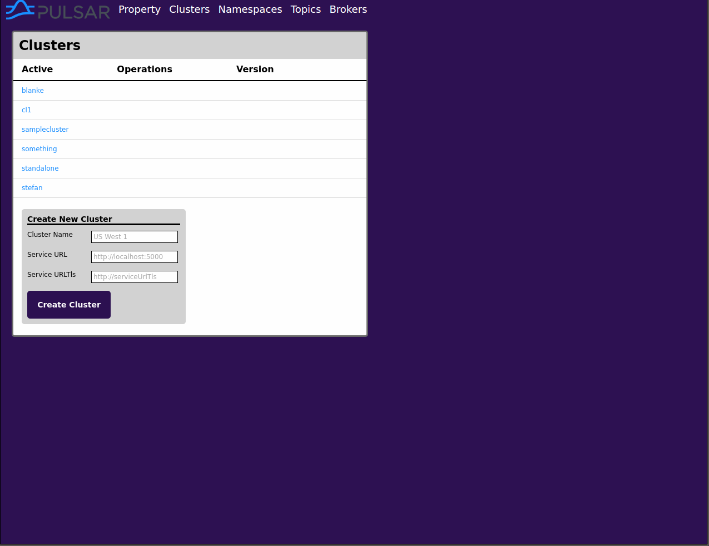
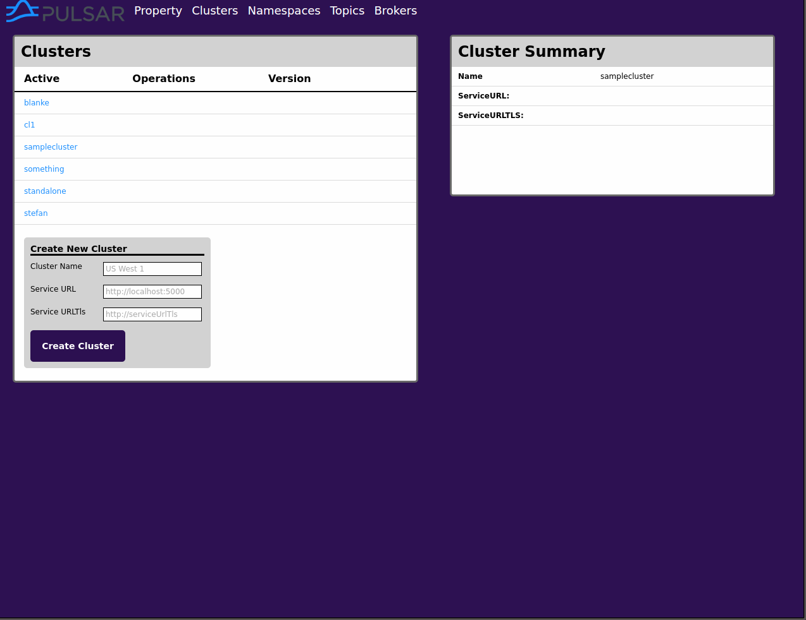
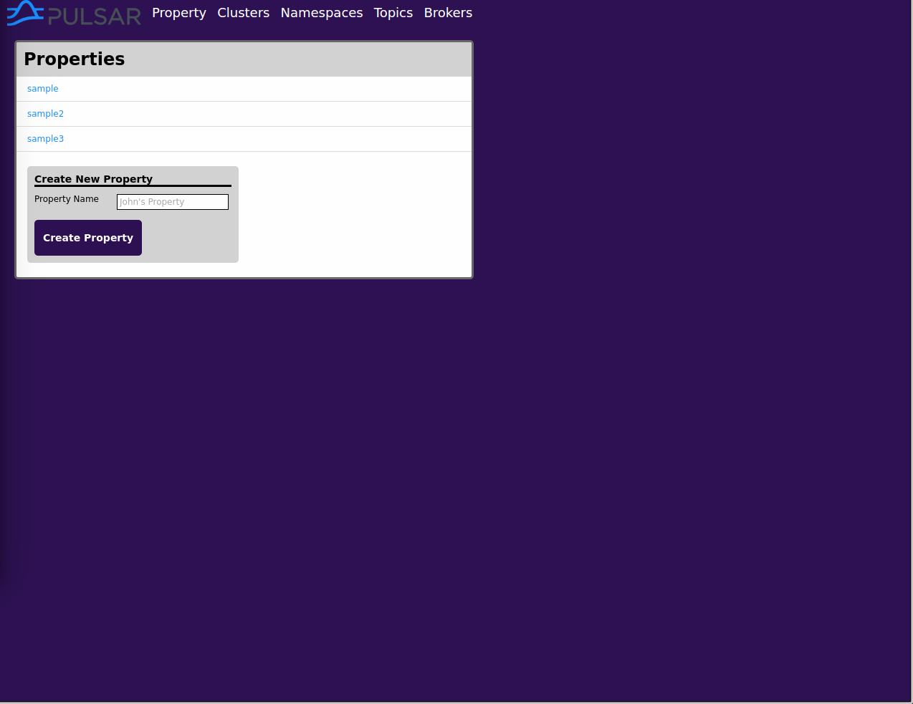
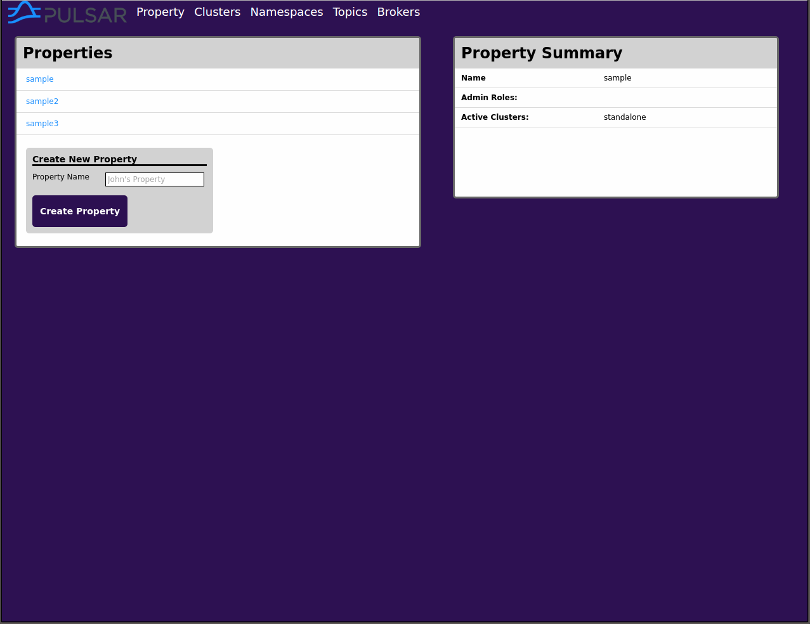

##**Pulsar Web App**

A web app for managing <a href='https://github.com/yahoo/pulsar'>Yahoo's Pulsar</a> built on React.JS/Redux.

##**Demo Instructions**
* cd into the root folder.
* Run  `npm install`
* Run  `webpack`
* cd into Pulsar_app/pulsar-1.14 and run `bin/pulsar standalone` to start a local server on local host 8080.
* cd in the root folder and run another local host (I recomment `http-server -p 3000`)
* Visit the app on http://localhost:3000/

##**Views**

